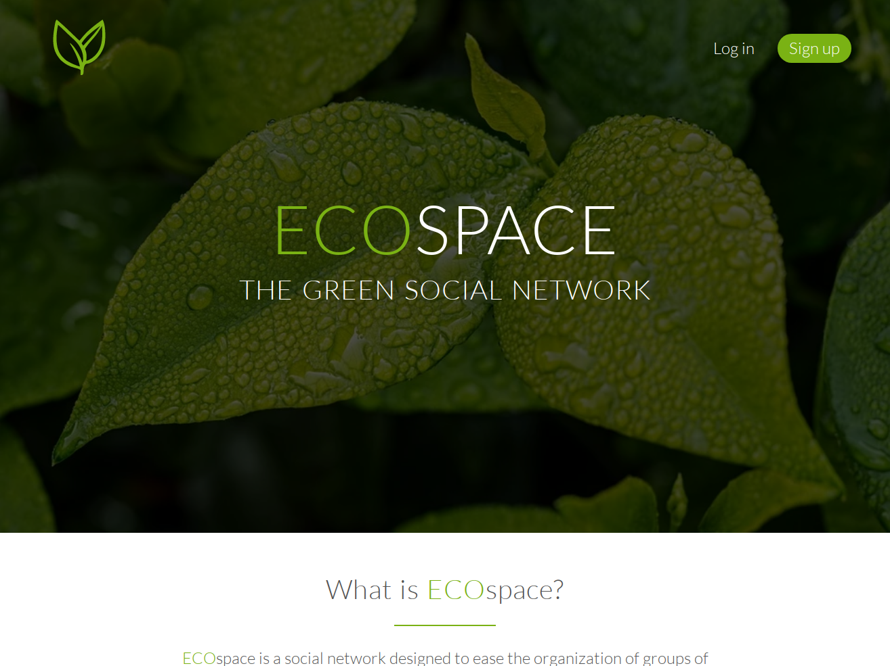
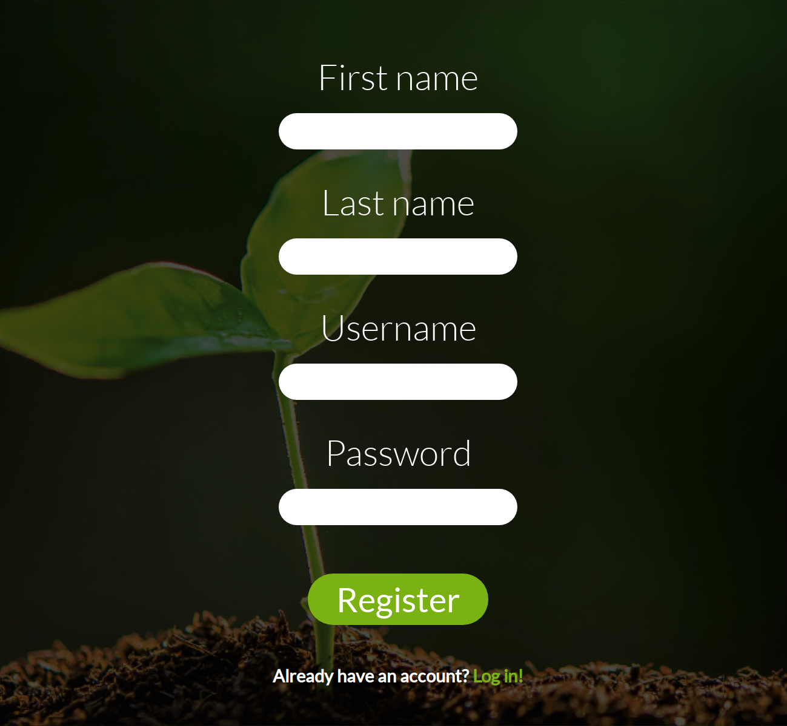
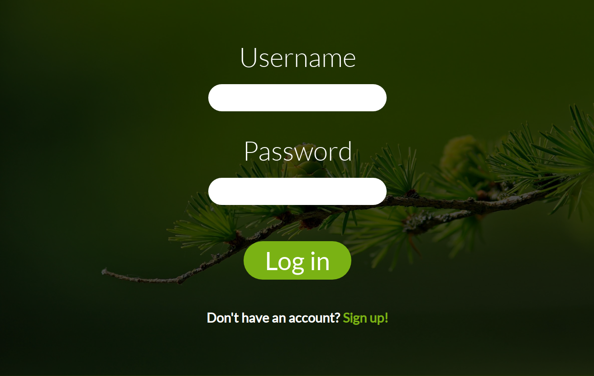
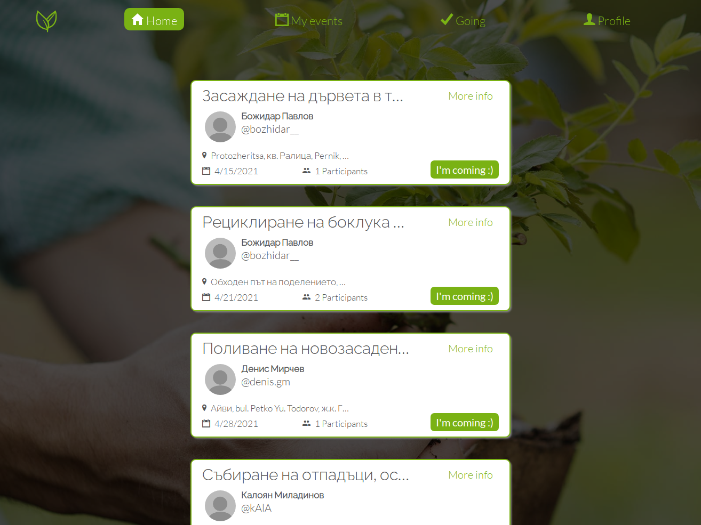
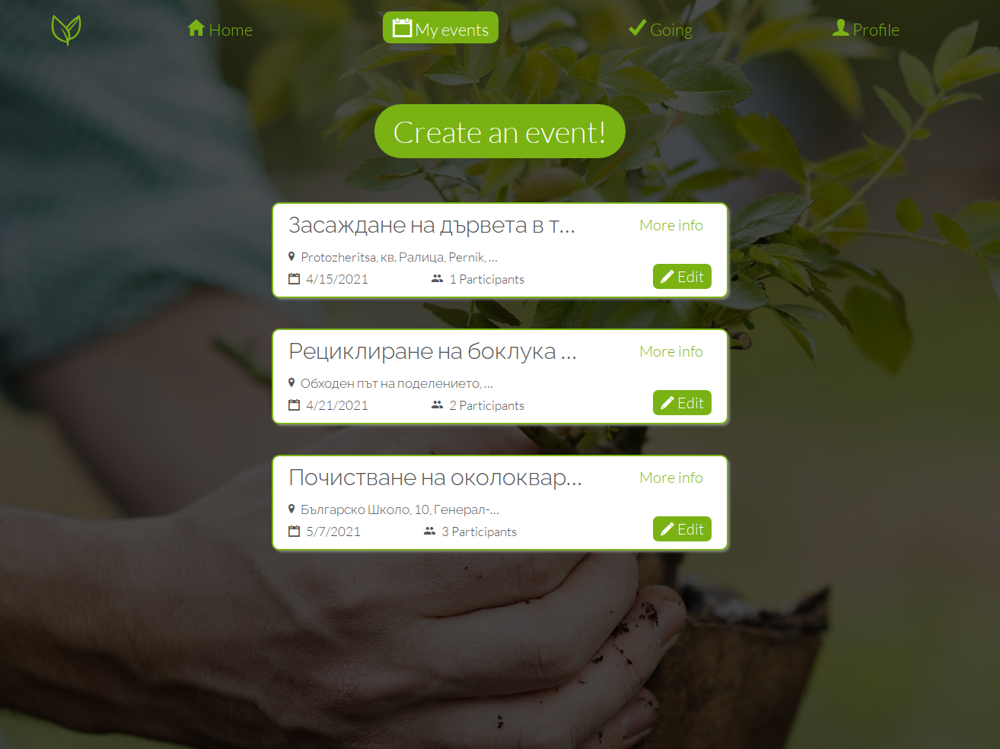
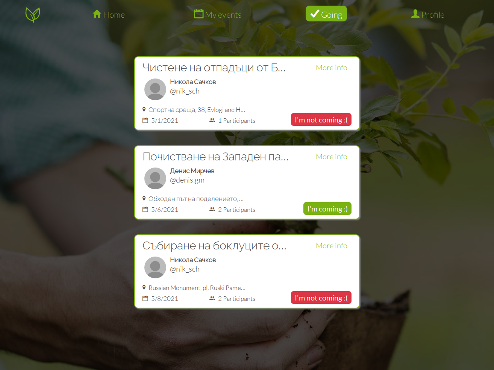
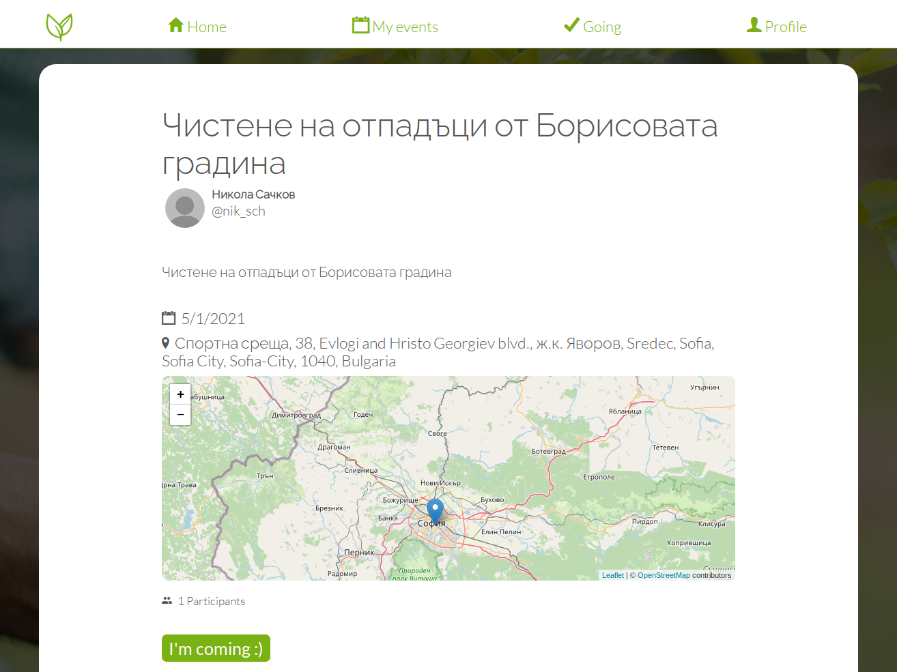
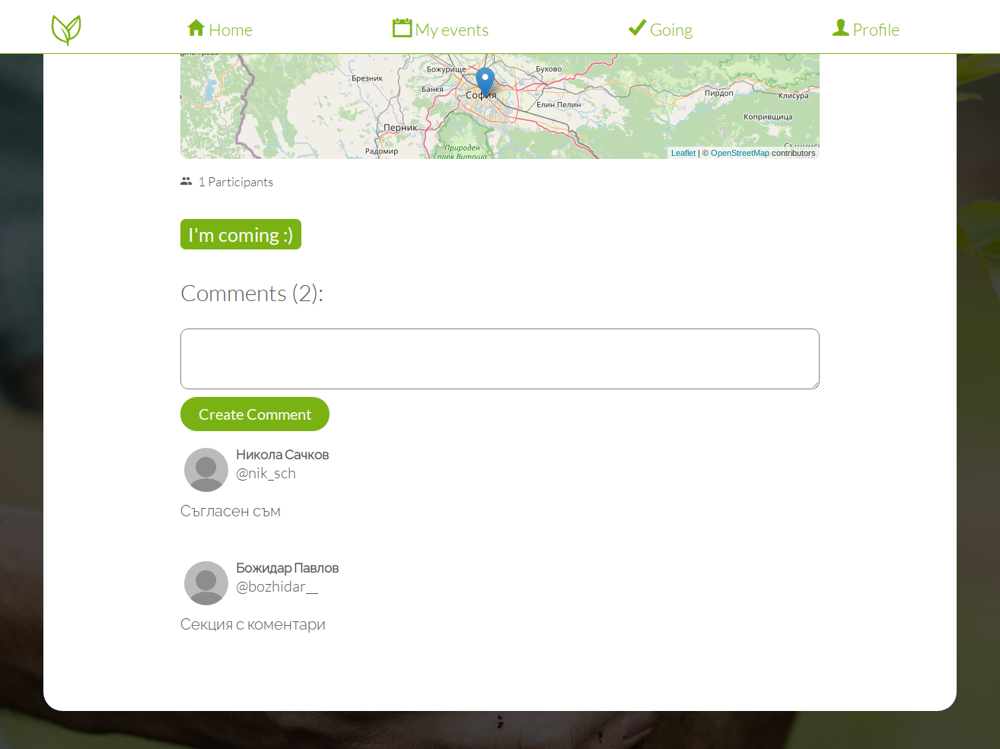
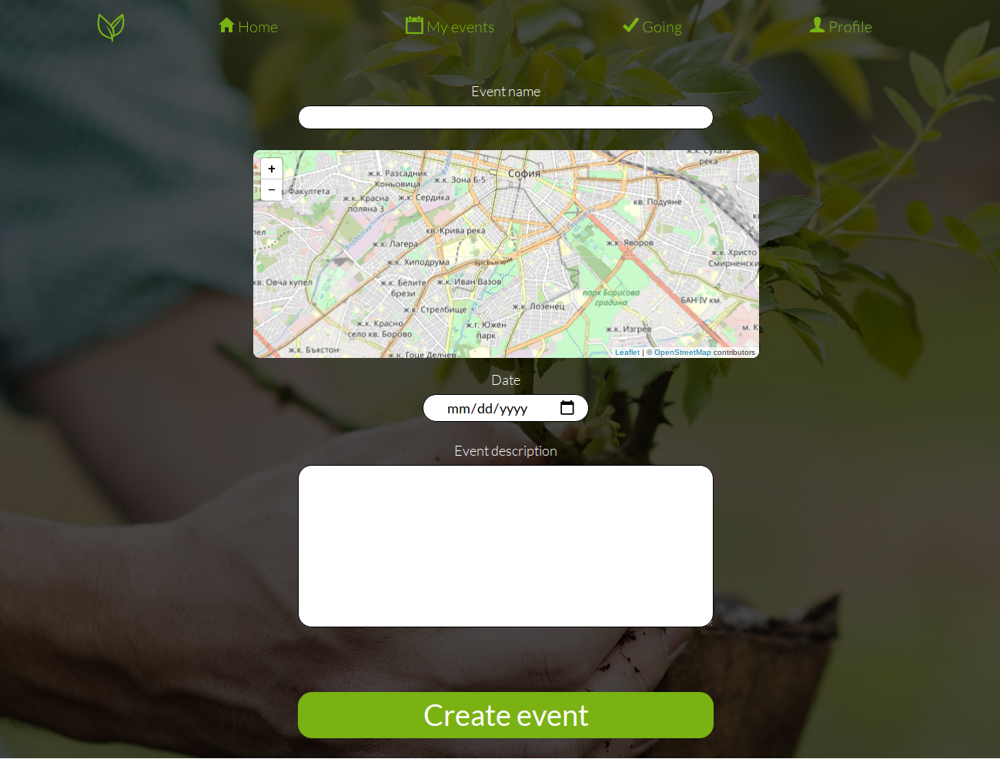
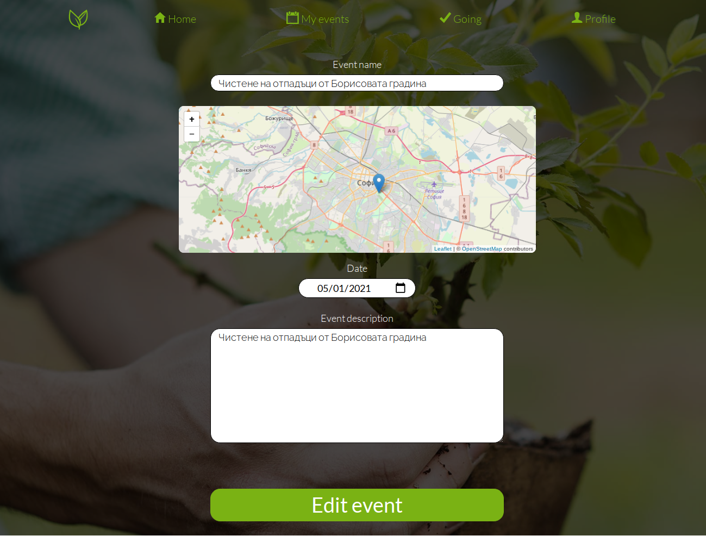

# 

<!-- README inspired by https://github.com/nukeop/nuclear/ -->

> _Социална мрежа_ за хора, заинтересовани от околната среда.



> If you're looking for the English translation, [it's here](https://github.com/false-positive/ecospace/blob/b6004ebf4515278669edcc9e143b5549bb6c23e7/README.md)

# Линкове

[Wiki](https://github.com/false-positive/ecospace/wiki)

[ECOspace Trello Board](https://trello.com/b/FBcRwvkN/ecospace)

## Какво е ECOspace?

ECOspace е _социална мрежа_, предназначена да улесни организирането на групи от доброволци със желание да помогнат с опазването на своите местни природни забележителности и да намалят глобалното замърсяване. Това се случва чрез създаване на събития, в които всеки потребител може да участва.

### Функции

-   Здрава и ефективна система за организиране на събития
-   Лесна за използване карта за гледане и избиране на местоположенията на събития
-   Раздел за коментари под всяко събитие
-   Много снимки на зелени растения

## Инсталация и стартиране

За да стартирате ECOspace от Вашия компютър, трябва да имате git и Python 3.7+ инсталирани и достъпни от командния ред.

### Инсталация

Клонирайте кода и инсталирайте всичките негови зависимости. Препоръчително е да ги инсталирате в Python виртуална среда.

> Допускаме, че Вие изпълнявате тези команди в POSIX-compliant shell (пр. bash) на Linux.
> Ако сте в Windows, повечето команди работят по същия начин, но има няколко разлики, които са отбелязани по-долу.

```shell
$ git clone https://github.com/false-positive/ecospace
$ cd ecospace/
$ python -m venv venv  # Създайте виртуалната среда
$ . venv/bin/activate  # Активирайте виртуалната среда
(venv) $
```

> Под Windows, използвайте `.\venv\Scripts\activate.bat` за да активирате виртуалната среда.

След като виртуалната Python среда е активирана, можете да инсталирате ECOspace, заедно със зависимостите си, използвайки:

```shell
(venv) $ pip install -e .
```

### Стартиране

Процеса на стартиране на ECOspace включва 3 стъпки:

1. Конфигуриране на Вашата среда със задаване на променливи на средата
2. Инициализиране на базата данни (необходимо само при първото изпълнение)
3. Стартиране на ECOspace

Това става със следните команди

```shell
(venv) $ export FLASK_APP=ecospace
(venv) $ export FLASK_ENV=development
(venv) $ flask db upgrade
(venv) $ flask run
```

> Под Windows, заменете `export` със `set`

И тогава можете да отворите <http://localhost:5000> във Вашия уебраузер за да видите ECOspace в действие.

## Технологии

Ето списък с библиотеки и проекти, използвани в тази кодова база:

-   [Flask](https://github.com/pallets/flask), лицензиран(а) под BSD-3-Clause лиценза
-   [FlaskRESTful](https://github.com/flask-restful/flask-restful), лицензиран(а) под BSD-3-Clause лиценза
-   [FlaskSQLAlchemy](https://github.com/pallets/flask-sqlalchemy), лицензиран(а) под BSD-3-Clause лиценза
-   [PyJWT](https://github.com/jpadilla/pyjwt), лицензиран(а) под MIT лиценза
-   [Leaflet](https://github.com/Leaflet/Leaflet), лицензиран(а) под BSD-2-Clause лиценза
-   [DOMPurify](https://github.com/cure53/DOMPurify), лицензиран(а) под двоен лиценз от Apache-2.0 и MPL-2.0
-   [Ionicons](https://github.com/ionic-team/ionicons), лицензиран(а) под MIT лиценза
-   [normalize.css](https://github.com/necolas/normalize.css/), лицензиран(а) под MIT лиценза

## Снимки











## Лиценз

This program is free software: you can redistribute it and/or modify
it under the terms of the GNU Affero General Public License as published by
the Free Software Foundation, either version 3 of the License, or
(at your option) any later version.

Прочетете [LICENSE](./LICENSE) за повече детайли.
