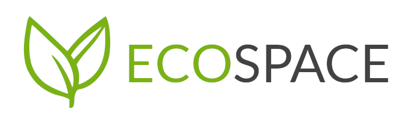

# 

<!-- README inspired by https://github.com/nukeop/nuclear/ -->

> A _social network_ for people passionate about the environment.


# Links

[ECOspace Trello Board](https://trello.com/b/FBcRwvkN/ecospace)

## What is ECOspace?

ECOspace is _social network_ designed to ease the organization of groups of volunteers who want to help the conservation of their local natural sights and reduce the global pollution. This happens by creating events in which every user can participate.

### Features

-   Robust and efficient event creation system
-   Easy to use map for selecting and viewing events' locations
-   Per-event comment section
-   Lots of pictures of green plants

## Installation and Running

You will need to have git and Python 3.7+ installed and they have to be accessible from the commandline.

### Installation

Clone the source code and install all the dependencies. It is recommended that you install them inside a virtual environment.

> It is assumed that you are running these commands in a POSIX-compliant shell.
> If you're on a Windows command prompt, most of the commands work the same way, but there are some differences, which are noted below.

```shell
$ git clone https://github.com/false-positive/ecospace
$ cd ecospace/
$ python -m venv venv  # Create a virtual environment
$ . venv/bin/activate  # Activate the virtual environment
(venv) $
```

> If you're on windows, run `.\venv\Scripts\activate.bat` to activate the virtual environment

Once you have activated the venv, you can install ECOspace inside of it, along with all its dependencies using:

```shell
(venv) $ pip install -e .
```

### Running

To run ECOspace, there are 3 steps involved:

1. Configure your environment by setting some variables
2. Initialize the database
3. Run ECOspace

That is done by running the following commands:

```shell
(venv) $ export FLASK_APP=ecospace
(venv) $ export FLASK_ENV=development
(venv) $ flask db upgrade
(venv) $ flask run
```

> On Windows, replace `export` with `set`

And then you can open <http://localhost:5000> in your browser to see ECOspace in action.

## Attributions

Here's a list of libraries and projects that are used in this codebase:

-   [Flask](https://github.com/pallets/flask), Licensed under the BSD-3-Clause License
-   [FlaskRESTful](https://github.com/flask-restful/flask-restful), Licensed under the BSD-3-Clause License
-   [FlaskSQLAlchemy](https://github.com/pallets/flask-sqlalchemy), Licensed under the BSD-3-Clause License
-   [PyJWT](https://github.com/jpadilla/pyjwt), Licensed under the MIT License
-   [Leaflet](https://github.com/Leaflet/Leaflet), Licensed under the BSD-2-Clause License
-   [DOMPurify](https://github.com/cure53/DOMPurify), Licensed under a dual license of Apache-2.0 and MPL-2.0
-   [Ionicons](https://github.com/ionic-team/ionicons), Licensed under the MIT License
-   [normalize.css](https://github.com/necolas/normalize.css/), Licensed under the MIT License

## Screenshots


<!--  <!-- add when profile page looks good -->


## License

This program is free software: you can redistribute it and/or modify
it under the terms of the GNU General Public License as published by
the Free Software Foundation, either version 3 of the License, or
(at your option) any later version.

See [LICENSE](./LICENSE) for more details.
